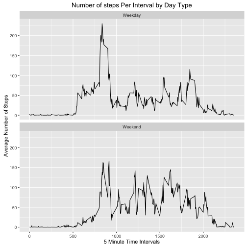

### Install and load the required packages:

```r
r_repos <- "http://cran.rstudio.com/"
install.packages("RCurl", repos = r_repos)
```

```
## 
## The downloaded binary packages are in
## 	/var/folders/cd/30qsbx151yz3xhh_s00zhh9w0000gn/T//RtmpDg41Z5/downloaded_packages
```

```r
install.packages("rmarkdown", repos = r_repos)
```

```
## 
## The downloaded binary packages are in
## 	/var/folders/cd/30qsbx151yz3xhh_s00zhh9w0000gn/T//RtmpDg41Z5/downloaded_packages
```

```r
install.packages("data.table", repos = r_repos)
```

```
## 
## The downloaded binary packages are in
## 	/var/folders/cd/30qsbx151yz3xhh_s00zhh9w0000gn/T//RtmpDg41Z5/downloaded_packages
```

```r
install.packages("ggplot2", repos = r_repos)
```

```
## 
## The downloaded binary packages are in
## 	/var/folders/cd/30qsbx151yz3xhh_s00zhh9w0000gn/T//RtmpDg41Z5/downloaded_packages
```

```r
install.packages("lattice", repos = r_repos)
```

```
## 
## The downloaded binary packages are in
## 	/var/folders/cd/30qsbx151yz3xhh_s00zhh9w0000gn/T//RtmpDg41Z5/downloaded_packages
```

```r
library(RCurl)
```

```
## Loading required package: bitops
```

```r
library(markdown)
library(data.table)
```

```
## data.table 1.9.6  For help type ?data.table or https://github.com/Rdatatable/data.table/wiki
```

```
## The fastest way to learn (by data.table authors): https://www.datacamp.com/courses/data-analysis-the-data-table-way
```

***

###  1) Get and clean the activity data:

```r
temp <- tempfile()
gitHubUrl <- "https://github.com/dholtz/RepData_PeerAssessment1/blob/master/activity.zip?raw=true"
download.file(gitHubUrl, temp)
activityMonitoringData <- read.csv(unz(temp, "activity.csv"))
unlink(temp)
cleanActivityMonitoringData <- na.omit(activityMonitoringData)
```


***

###  2) Total Number of Steps Taken Each Day

#### 2a) Total Number of Steps taken per Day

```r
stepsPerDay <- aggregate(steps ~ date, cleanActivityMonitoringData, sum)
```

#### 2b) Total Number of Steps taken each Day (Historgram)

```r
hist(stepsPerDay$steps, main = "Total Steps Taken per Day", xlab = "Steps Per Day", 
    col = 1)
```


#### 2c) Mean and Median of total number of steps taken per day

```r
mean(stepsPerDay$steps)
```

```
## [1] 10766.19
```

```r
median(stepsPerDay$steps)
```

```
## [1] 10765
```


***

### 3) What is the average daily activity pattern?

```r
intervalOfStepsAverage <- aggregate(steps ~ interval, cleanActivityMonitoringData, 
    mean)
```

#### 3a) Time Series plot

```r
plot(intervalOfStepsAverage$interval, intervalOfStepsAverage$steps, type = "l", 
    main = "Average Daily Activity Pattern", xlab = "5 Minute Time Intervals", 
    ylab = "Average Number of Steps")
```


### 3b) 5-minute interval, on average across all days, contains the maximum number of steps?

```r
maxIntervalSteps <- intervalOfStepsAverage[which.max(intervalOfStepsAverage$steps), 
    ]
```
#### -The interval, 835 contained, 206.1698113 steps.


***

###  4) Strategy for imputing Missing Data

#### 4a) Total number of missing values in the dataset (the total number of rows with NAs)

```r
totalNumNAs <- colSums(is.na(activityMonitoringData))
```
##### - There are 2304, NA's in the steps, 0, NA's in the date,
##### and 0, NA's in the interval.

***

###  5) Total Number of Steps Taken Each Day, AFTER missing values are imputed

#### 5a) Fill in the missing values with the mean value for the 5-minute interval

```r
mean5MinIntervalFn <- function(steps, interval) {
    filled <- NA
    if (!is.na(steps)) {
        filled <- c(steps)
    } else {
        filled <- intervalOfStepsAverage[intervalOfStepsAverage$interval == 
            interval, "steps"]
    }
    filled
}

missingValuesFilled <- activityMonitoringData
missingValuesFilled$steps <- mapply(mean5MinIntervalFn, missingValuesFilled$steps, 
    missingValuesFilled$interval)
missingFilledIntervalOfStepsAverage <- aggregate(steps ~ date, missingValuesFilled, 
    sum)
```


```r
# Sanity check that all NAs are removed from original data set
postNAFillCheck <- colSums(is.na(missingValuesFilled))
```
##### - There are 0, 0, 0, NA's in the filled data set.

#### 5b) Compare the original steps taken each day with NA filled in data.

```r
par(mfrow = c(2, 1))

hist(stepsPerDay$steps, main = "Total Steps Taken per Day / Original Data", 
    xlab = "Steps Per Day", col = 1)
hist(missingFilledIntervalOfStepsAverage$steps, main = "Imputed Total Steps Taken per Day / NA's Removed Data", 
    xlab = "Steps Per Day", col = 1)
```


```r
mean(stepsPerDay$steps)
```

```
## [1] 10766.19
```

```r
median(missingFilledIntervalOfStepsAverage$steps)
```

```
## [1] 10766.19
```

#### - There are NO differences from the initial estimates from the first part of the assignment after imputing missing data.

***

###  6) Comparing the Average Number of Steps taken per 5-minute Interval Across Weekdays and Weekends

#### 6a) Create factor variable in the 'filled' data set with two levels, "weekday" and "weekend" indicating
#### whether a given date is a weekday or weekend day.

```r
weekDayOrWeekEnd <- function(strDate) {
    w <- NA
    val <- weekdays(as.Date(strDate, "%Y-%m-%d"))
    if (!(val == "Saturday" || val == "Sunday")) {
        w <- "Weekday"
    } else {
        w <- "Weekend"
    }
    w
}

missingValuesFilled$typeOfDay <- as.factor(sapply(missingValuesFilled$date, 
    weekDayOrWeekEnd))

imputedStepsPerDay <- aggregate(steps ~ interval + typeOfDay, missingValuesFilled, 
    mean)

# load ggplot 2 library
library(ggplot2)

qplot(interval, steps, data = imputedStepsPerDay, geom = c("line"), xlab = "5 Minute Time Intervals", 
    ylab = "Average Number of Steps", main = "Number of steps Per Interval by Day Type") + 
    facet_wrap(~typeOfDay, ncol = 1)
```



##### - From the plot, it appears that the person is more active on the weekends , with a slight peak during the week during the morning hours.

***

#### - This can be more easily visualized by showing the data on a single plot.

```r
library(lattice)

xyplot(steps ~ interval, data = imputedStepsPerDay, groups = imputedStepsPerDay$typeOfDay, 
    type = "l", grid = T, ylab = "Average number of steps", xlab = "5-min. intervals from midnight", 
    main = "Weekdays (in blue) vs. Weekends (in Purple)")
```


